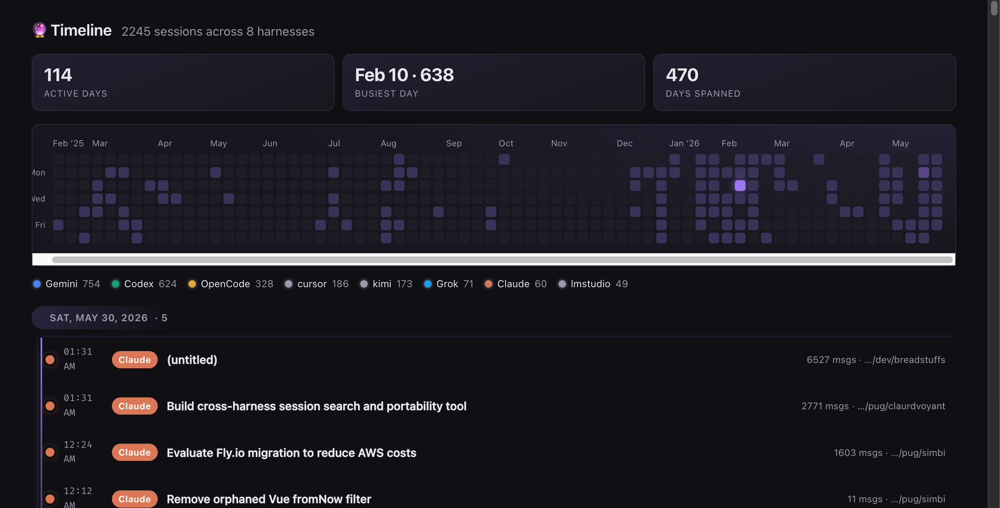

<div align="center">

# 🔮 claurdvoyant

### Your AI coding sessions are gold. Stop letting them rot in scattered folders.

**One tool to find, read, search, port, and stream every agent session you've ever run — across every harness.**

`claude` · `codex` · `grok` · `opencode` · `gemini` · `hermes` · `openclaw` · `cursor` · …

*parse anything · search by meaning · resume anywhere · let your agents read each other's minds*

<br>



<sub>the desktop app reading 2,245 real local sessions across 8 harnesses — heatmap, harness legend, and a live feed</sub>

</div>

---

## The problem (you've felt this)

You spent three hours teaching an agent your codebase. That context — the dead ends, the decisions, the hard-won understanding — is some of the most valuable output you produce. And then:

- 🙈 **You can't find it.** It's one of hundreds of `.jsonl` files in a folder named after a path. (Yes, you keep the important session IDs in a notes app. Everyone does.)
- ⛓️ **It's trapped.** Most harnesses only resume a session from the *exact directory* it ran in. Move the project, lose the thread.
- 🏝️ **It's stranded.** Started in Claude Code but want to continue in Codex? Tough. Every tool speaks its own dialect and none of them talk.

Restarting from scratch is the most expensive thing you do all day. **claurdvoyant makes sure you never have to.**

## What you can actually do with it

```sh
# 🔎 find that session from last week by what it was ABOUT, not where it lived
cv search "the flux inference refactor"        # full-text, instant
cv-search semantic "formalizing proofs"        # by meaning — no keyword overlap needed

# 🚀 take a Claude session and continue it in Codex. for real.
cv convert da9174f4 --to codex
#   ✦ wrote ~/.codex/sessions/2026/…/rollout-….jsonl
#   ↳ codex resume 019e75e0-…

# 🧳 break a session out of its directory jail (brings CLAUDE.md / MEMORY.md along)
cv port da9174f4 --to-dir ~/new/home

# 👁️ watch every agent on your machine work, live, in one feed
cv scry
```

…and a couple that didn't exist before:

- 🧠 **An MCP server** so a *running* agent can read **other** agents' sessions — "what happened in this project before?", "what's my sibling agent doing right now?" — and even **`await_omen`**: block until another session prints something matching a regex.
- 📣 **A coordination board** (`cv board` + MCP): agents post status and hand off work to each other. With the daemon mirroring activity, it's a live feed across your whole **cloud fleet**.
- 🌐 **A zero-install web viewer**: drag a zip of any harness folder into your browser and explore it. Nothing uploaded, all WASM.

## 🪐 17 harnesses, one IR

| | Harness | Parse | Convert *to* | | | Harness | Parse | Convert *to* |
|---|---|:--:|:--:|---|---|---|:--:|:--:|
| ✅ | **Claude Code** | ✅ | ✅ | | ✅ | **Cursor** | ✅ | — |
| ✅ | **Codex CLI** | ✅ | ✅ | | ✅ | **Kimi CLI** | ✅ | ✅ |
| ✅ | **Grok CLI** | ✅ | ✅ | | ✅ | **Qwen Code** | ✅ | ✅ |
| ✅ | **OpenCode** | ✅ | ✅ | | ✅ | **LM Studio** | ✅ | ✅ |
| ✅ | **Gemini / Antigravity** | ✅ | ✅ | | ✅ | **Cline** | ✅ | ✅ |
| ✅ | **Hermes** (Nous) | ✅ | ✅ | | ✅ | **Roo Code** | ✅ | ✅ |
| ✅ | **OpenClaw** | ✅ | ✅ | | ✅ | **Continue** | ✅ | ✅ |
| 🔒 | **Claude / ChatGPT apps** | detected¹ | — | | ✅ | **Goose** (Block) | ✅ | — |

<sub>¹ The Claude app keeps transcripts server-side; the ChatGPT app keeps them locally but encrypted at rest. We detect the install and document exactly why neither is readable — see [`docs/FORMATS.md`](docs/FORMATS.md).</sub>

**Conversion is N-way** among the 13 emit-capable harnesses: any → any, mediated by one unified IR. Every format reverse-engineered in [`docs/FORMATS.md`](docs/FORMATS.md). Bringing your own? → [`ADDING_HARNESS.md`](ADDING_HARNESS.md) 💛

## ✨ More than a viewer

- **🧵 Splice & loom** — compose a new session from spans of others (`cv splice A:0-12 B:6-`), or *fork-and-graft* a branch and **generate** its continuation with an LLM (`cv loom … --generate`). Works via OpenRouter / Anthropic / **LM Studio (free, local, offline)**. Loom agent transcripts like a [Janus loom](https://generative.ink/posts/loom-interface-to-the-multiverse/), across any harness.
- **🧠 Distill** — `cv distill <id>` turns a session into a durable `MEMORY.md` digest (decisions, gotchas, where things live). Your archive *compounds* instead of rotting.
- **🔮 Recall** — semantic "have I solved this before?" — as a `cv recall` command *and* an MCP tool that hands a running agent the relevant past span.
- **🔒 Redact** — `cv redact <id>` scrubs secrets/PII so a transcript is safe to share.
- **📣 Coordination board** — agents post status, hand off work, and grab tasks with a **distributed lock** (`board_claim`) so a fleet never duplicates effort. `await_omen` blocks until a session matches a regex.
- **🖥️ Desktop app + 🌐 web viewer** — the Tauri app reads **all your local sessions natively** (zero setup) and lays the corpus out beautifully:
  - a **Projects** lens — every repo, every agent that touched it, over time;
  - a GitHub-style **activity heatmap** timeline (a constellation of your working days);
  - side-by-side **Compare**, a **Stats** dashboard, a visual **loom composer** (OpenRouter *or* free local LM Studio generation), and a live **fleet dashboard**;
  - **sub-agent trees** — a Claude Task session's children, nested and lazy-loaded inline, each labeled with its task prompt.

  The browser build is zero-install — drop a harness zip, nothing uploaded (all WASM).
- **🔌 Harness integrations** — plug claurdvoyant into the agents' own hooks/MCP/plugins ([`integrations/`](integrations/)): SessionEnd → archive + distill, SessionStart → recall, events → the board.

## 📖 Manual

Full docs — every CLI command, the MCP tools, the daemon's HTTP API, the app, cross-harness conversion, and the harness table — live in the **[user manual](https://emberian.github.io/claurdvoyant/manual/)** (mdBook, also under `manual/`).

## 🛠️ Install

**Prebuilt binaries** for macOS / Linux / Windows (arm64 · x64 · x86) ship on every release — grab the latest from **[Releases](https://github.com/emberian/claurdvoyant/releases/latest)** (`cv` · `cv-mcp` · `cvd` · `cv-tui` · `cv-search`), or one-line it:

```sh
curl --proto '=https' --tlsv1.2 -LsSf https://github.com/emberian/claurdvoyant/releases/latest/download/cv-installer.sh | sh
```

Or from source:

```sh
cargo build --release          # → target/release/{cv, cv-mcp, cvd, cv-tui, cv-search}
```

## 🧠 Let agents read each other's minds (MCP)

```sh
claude mcp add claurdvoyant -- /path/to/target/release/cv-mcp
```

18 tools, incl: `list_sessions` · `search_sessions` · `read_session` · `project_sessions` · **`recall`** (semantic "where was this solved before") · **`await_omen`** (block until a session matches a regex) · `board_post/read/await` + `board_claim/release/who` (coordination + distributed locks).

## 📡 Archive your whole fleet (`cvd`)

```sh
cvd sync     # snapshot every session into ~/.claurdvoyant
cvd watch    # follow live + archive as sessions change → a fleet activity feed
```

## 🧬 The OpenSession standard

After staring into seven different transcript formats, we wrote down the one they *should* have agreed on: **[OpenSession](docs/OPENSESSION.md)** — a small, honest, harness-neutral interchange format (the key heresy: *cwd is metadata, not identity*). claurdvoyant's IR is its reference implementation. If you ship a harness, emit OpenSession and everyone's sessions become portable by construction. 🤝

## 🏗️ Under the hood

One IR (`Session → Message → Block{Text|Thinking|ToolUse|ToolResult|File|Image}`), one `Adapter` per harness (`discover` + `parse` + `emit`), plus `loom` / `redact` / `board` / `watch` / `ingest` modules — and small crates on top: **`cv`** (CLI) · **`cv-mcp`** (MCP) · **`cvd`** (daemon + `serve`) · **`cv-search`** (tantivy + `model2vec`) · **`cv-llm`** (distill/generate) · **`cv-web`** (WASM) · **`app/`** (Tauri desktop).

```
parse(any harness) → 🔮 unified IR → search · convert · port · loom · distill · archive · coordinate · view
```

## 🧪 Status

Built in a wild few sessions, much of it by a swarm of agents working disjoint files. ✨ Honest about the edges:

- **17 harnesses parse**; the 7 core ones also **emit** (N-way conversion). The newer 8 (Cursor, Kimi, Qwen, LM Studio, Cline, Roo, Continue, Goose) are parse-only for now.
- **Robustness:** 2000+ real sessions parse with **0 panics**; parsers are fuzz-tested against hostile input.
- The full-text index trades disk for speed; Gemini's protobuf `.pb` is opaque; a few sidecar tool-call streams aren't merged yet.
- Historical format variants are an explicit goal — see [`ADDING_HARNESS.md`](ADDING_HARNESS.md), and **please send your own harness logs** (we can only test what we can see).

PRs and weird old transcripts deeply welcome. 💜

<div align="center"><sub>made with 🔮 and an unreasonable amount of enthusiasm · MIT/Apache-2.0</sub></div>
